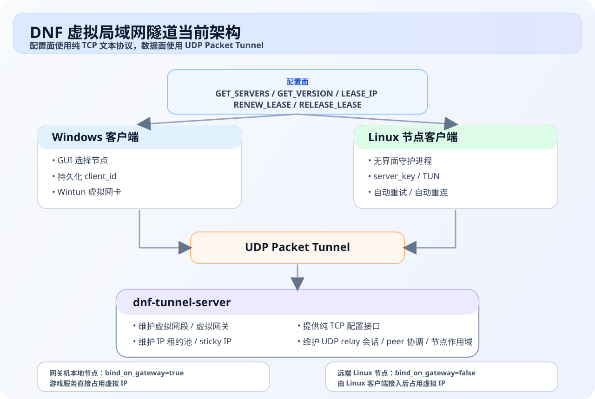

# DNF 虚拟局域网隧道项目

本项目的当前主线实现，不再是早期的“单纯端口复用 + HTTP API”方案，而是一套完整的虚拟局域网隧道：

- 服务端负责维护虚拟网段、租约、配置接口、UDP Packet Tunnel 数据面和节点作用域。
- Windows 客户端通过 `Wintun + Packet Tunnel` 接入虚拟网络，支持多节点选择、自动更新、持久化机器身份。
- Linux 客户端通过 `TUN + Packet Tunnel` 作为远端节点接入，支持启动重试、运行中断线恢复、systemd 托管。

如果你之前看过仓库里的旧说明，请以本文档为准。根目录旧 README 提到的旧 `servers/listen_port/game_server_ip` 配置、旧 HTTP API 描述、旧单服务器客户端流程，已经不代表当前主线实现。

## 1. 当前架构



| 角色 | 当前实现 | 主要职责 |
| --- | --- | --- |
| 配置面 | 纯 TCP 文本协议 | `GET_SERVERS`、`GET_VERSION`、`LEASE_IP`、`RENEW_LEASE`、`RELEASE_LEASE` |
| Windows 客户端 | `Wintun + Packet Tunnel` | 选节点、申请租约、接入虚拟局域网 |
| Linux 节点客户端 | `TUN + Packet Tunnel` | 远端节点接入、自动重试、自动重连 |
| 服务端 | `dnf-tunnel-server` | 维护虚拟网段、租约池、UDP relay 和节点作用域 |
| 网关机本地节点 | `bind_on_gateway=true` | 游戏服务直接运行在公网入口机器上 |
| 远端 Linux 节点 | `bind_on_gateway=false` | 由 Linux 客户端接入后占用对应虚拟 IP |

当前主线可以同时覆盖两类场景：

- 网关机本地节点：游戏服务就在公网入口服务器本机，`bind_on_gateway=true`
- 远端 Linux 节点：游戏服务跑在另一台 Linux 上，由 `dnf-linux-client` 接入

## 2. 组成模块

### 服务端

代码目录：`服务器源码/`

主要职责：

- 维护虚拟网段、虚拟网关和节点列表
- 提供纯 TCP 配置接口
- 维护 IP 租约池
- 维护 UDP Packet Tunnel 会话
- 为不同节点建立独立的 `server_key` 作用域
- 支持日志级别、版本信息和配置热重载

主程序与构建入口：

- `服务器源码/tcp_tunnel_server.cpp`
- `服务器源码/tcp_config_server.cpp`
- `服务器源码/ip_pool_manager.cpp`
- `服务器源码/Makefile`

### Windows 客户端

代码目录：`客户端源码/`

当前只保留多服务器版构建链路。

主要职责：

- 启动时读取内嵌配置
- 通过 TCP 配置接口获取节点列表
- GUI 选择节点
- 申请 / 续租 / 释放虚拟 IP
- 启动 `Wintun + Packet Tunnel`
- 自动更新
- 在 `%APPDATA%\\DNFProxy\\client_identity.ini` 中持久化机器身份

主要文件：

- `客户端源码/tcp_proxy_client_no_config.cpp`
- `客户端源码/tcp_config_client.cpp`
- `客户端源码/ip_lease_client.cpp`
- `客户端源码/packet_tunnel_client.cpp`
- `客户端源码/wintun_manager.cpp`
- `客户端源码/server_selector_gui.cpp`
- `客户端源码/config_injector_multiserver.cpp`

### Linux 客户端

代码目录：`linux客户端源码/`

主要职责：

- 通过 TCP 配置接口获取节点列表
- 申请 / 续租 / 释放虚拟 IP
- 创建 TUN 接口
- 建立 UDP Packet Tunnel 会话
- 启动失败自动重试
- 运行中断线自动恢复

主要文件：

- `linux客户端源码/main.cpp`
- `linux客户端源码/linux_config_client.cpp`
- `linux客户端源码/linux_lease_client.cpp`
- `linux客户端源码/linux_packet_tunnel_client.cpp`
- `linux客户端源码/linux_tun_manager.cpp`
- `linux客户端源码/build.sh`
- `linux客户端源码/run.sh`

### 共享协议头

目录：`shared/`

另外，服务端、Windows 客户端、Linux 客户端各自源码目录里也保留了本地副本协议头，主要涉及：

- `ip_lease_protocol.h`
- `packet_tunnel_protocol.h`

## 3. 核心概念

### `virtual_subnet`

整个虚拟局域网网段，例如 `192.168.200.0/24`。

### `virtual_gateway`

虚拟局域网里的逻辑网关地址，例如 `192.168.200.1`。客户端路由会指向它，但真实公网转发仍由隧道服务端负责。

### `server_virtual_ip`

节点在虚拟局域网里的服务地址，例如 `192.168.200.131`。客户端最终访问的是这个虚拟地址，而不是公网 IP。

### `server_key`

节点作用域标识。当前实现里，默认就是 `nodes` 数组的顺序编号字符串，从 `1` 开始。

它非常重要，因为：

- IP 租约是按 `server_key` 分池的
- 多个节点可以复用同一个 `server_virtual_ip`
- 当 `server_virtual_ip` 重复时，Linux 客户端必须显式指定 `server_key`

### `client_id`

客户端稳定身份标识。

- Windows：默认使用持久化机器身份，存放在 `%APPDATA%\\DNFProxy\\client_identity.ini`，内部会结合 `MachineGuid`
- Linux：默认使用主机名，也可以手动写死

`client_id` 会影响 sticky IP 复用。

### `session_uuid`

一次运行实例的会话标识。每次启动都会重新生成，但服务端会优先尝试把原来的 IP 迁移给相同 `client_id`。

### `preferred_ip`

客户端偏好的虚拟 IP。通常用于：

- 续租丢失后尝试拿回上一次 IP
- Linux 节点主动请求保留地址

### `bind_on_gateway`

- `true`：节点就在公网入口服务器本机
- `false`：节点需要由远端 Linux 客户端接入

如果配置里只有 1 个节点，且没有显式写任何 `bind_on_gateway`，当前服务端会自动把它视为 `true`。

## 4. 目录结构

```text
服务器端口复用/
├── README.md
├── config.json
├── run.sh
├── install.sh
├── shared/
├── 服务器源码/
│   ├── tcp_tunnel_server.cpp
│   ├── tcp_config_server.cpp
│   ├── ip_pool_manager.cpp
│   ├── tun_manager.cpp
│   └── Makefile
├── 客户端源码/
│   ├── 0.完整编译流程_多服务器版.ps1
│   ├── 1.编译多服务器版.ps1
│   ├── 3.生成配置器_多服务器版.ps1
│   ├── build-multi-server-client.ps1
│   ├── build-multi-server-injector.ps1
│   ├── config_injector_multiserver.cpp
│   ├── tcp_proxy_client_no_config.cpp
│   ├── tcp_config_client.cpp
│   ├── ip_lease_client.cpp
│   ├── packet_tunnel_client.cpp
│   ├── peer_link_manager.cpp
│   ├── wintun_manager.cpp
│   └── server_selector_gui.cpp
└── linux客户端源码/
    ├── build.sh
    ├── run.sh
    ├── install.sh
    ├── dnf-linux-client.conf.example
    ├── main.cpp
    ├── linux_config_client.cpp
    ├── linux_lease_client.cpp
    ├── linux_packet_tunnel_client.cpp
    └── linux_tun_manager.cpp
```

根目录的 `run.sh` 和 `install.sh` 目前就是 Linux 客户端的便捷入口脚本，作用与 `linux客户端源码/` 下同名脚本一致。

## 5. 服务端配置格式

当前主配置文件是根目录 `config.json`，格式如下：

```json
{
  "network": {
    "tunnel_port": 30003,                    # 公网隧道入口端口
    "virtual_subnet": "192.168.200.0/24",   # 虚拟局域网网段
    "virtual_gateway": "192.168.200.1",     # 虚拟网关 IP
    "tunnel_server_ip": "vpn.example.com",  # 客户端看到的公网入口域名或 IP
    "max_connections": 1000,                # 最大并发
    "lease_seconds": 120                    # 租约时长
  },

  "nodes": [
    {
      "name": "86幻境",
      "server_virtual_ip": "192.168.200.131",
      "bind_on_gateway": true,
      "download_url": ""
    }
  ],

  "version": {
    "md5": "00000000000000000000000000000000",
    "download_url": "https://example.com/client.exe"
  },

  "log_level": "INFO",

  "api_config": {
    "enabled": true,
    "port": 35000
  }
}
```

说明：

- 配置解析器支持 `#` 行内注释，仓库示例文件可以直接保留这种写法
- `nodes` 的顺序会决定节点 `id`，同时也决定默认 `server_key`
- `api_config` 当前实际跑的是纯 TCP 配置服务，不是 HTTP REST API
- `version.md5` 和 `version.download_url` 用于 Windows 客户端启动时检查更新

### `network` 字段

- `tunnel_port`：UDP Packet Tunnel 入口端口
- `virtual_subnet`：虚拟网段
- `virtual_gateway`：虚拟网关
- `tunnel_server_ip`：返回给客户端的公网入口地址，可以是 IPv4、IPv6 或域名
- `max_connections`：当前入口允许的连接数上限
- `lease_seconds`：租约有效期

### `nodes` 字段

- `name`：节点显示名称，Windows GUI 和 Linux 选择逻辑都会看到它
- `server_virtual_ip`：节点对外暴露的虚拟地址
- `bind_on_gateway`：
  - `true` 表示游戏服务就在网关机本地
  - `false` 表示需要 Linux 节点客户端接入
- `download_url`：可选，下发给客户端展示或分发

## 6. 多节点与同 IP 复用

当前服务端已经支持多个节点共用同一个 `server_virtual_ip`，租约和会话按 `server_key` 隔离。

典型场景：

- 节点 1：`70s2a1`
- 节点 2：`86幻境-2`
- 两个节点本地都把游戏服务绑定为 `192.168.200.131`

服务端配置可以这样写：

```json
{
  "network": {
    "tunnel_port": 30003,
    "virtual_subnet": "192.168.200.0/24",
    "virtual_gateway": "192.168.200.1",
    "tunnel_server_ip": "vpn.example.com",
    "max_connections": 1000,
    "lease_seconds": 120
  },
  "nodes": [
    {
      "name": "70s2a1",
      "server_virtual_ip": "192.168.200.131",
      "bind_on_gateway": false,
      "download_url": ""
    },
    {
      "name": "86幻境-2",
      "server_virtual_ip": "192.168.200.131",
      "bind_on_gateway": false,
      "download_url": ""
    }
  ],
  "log_level": "INFO",
  "api_config": {
    "enabled": true,
    "port": 35000
  }
}
```

注意：

- Windows 客户端可以通过 GUI 选择具体节点
- Linux 客户端在这种场景下不要只写 `server_virtual_ip`
- 因为两个节点的 `server_virtual_ip` 一样，Linux 客户端必须显式写 `server_key=1` / `server_key=2`，或者使用唯一节点名称 / id

## 7. 纯 TCP 配置接口

当前配置面不是 HTTP，而是一个简单 TCP 文本协议。

服务端支持的命令：

```text
GET_SERVERS
GET_VERSION
LEASE_IP <server_key> <session_uuid> <client_id> [preferred_ip]
RENEW_LEASE <server_key> <session_uuid>
RELEASE_LEASE <server_key> <session_uuid>
```

### `GET_SERVERS`

返回 JSON，字段以当前实现为准：

```json
{
  "servers": [
    {
      "id": 1,
      "name": "86幻境",
      "server_virtual_ip": "192.168.200.131",
      "tunnel_server_ip": "vpn.example.com",
      "tunnel_port": 30003,
      "download_url": "",
      "virtual_subnet": "192.168.200.0/24",
      "virtual_gateway": "192.168.200.1",
      "lease_seconds": 120,
      "bind_on_gateway": true
    }
  ]
}
```

### `GET_VERSION`

返回：

```json
{
  "md5": "6ad6275334903d899d017b513e609291",
  "download_url": "https://example.com/client.exe"
}
```

### `LEASE_IP`

成功后会返回：

```json
{
  "status": 0,
  "message": "ok",
  "server_key": "1",
  "virtual_ip": "192.168.200.2",
  "subnet_mask": "255.255.255.0",
  "gateway_ip": "192.168.200.1",
  "server_virtual_ip": "192.168.200.131",
  "mtu": 1400,
  "lease_seconds": 120,
  "reused_previous_ip": true,
  "routes": ["192.168.200.0/24"]
}
```

说明：

- `config_api_url` / `config_api_port` 这组 Windows 客户端字段名是历史兼容命名
- 但实际协议已经是 TCP 文本命令，不要再按 HTTP API 理解

## 8. 租约与 IP 分配规则

服务端当前的租约分配逻辑，按每个 `server_key` 独立维护一个 IP 池。

分配优先级大致如下：

1. 如果同一个 `session_uuid` 已有活动租约，直接续用
2. 尝试把同一 `client_id` 的活动租约迁移到新的 `session_uuid`
3. 尝试复用最近释放的 sticky 租约
4. 如果客户端给了 `preferred_ip`，优先尝试该地址
5. 否则从当前池里按最小可用地址开始分配

当前实现的关键点：

- `lease_seconds` 默认 120 秒，可通过配置修改
- sticky 保留窗口当前代码默认 300 秒
- `client_id` 为空时，sticky 复用能力会明显下降
- IP 池的自然分配顺序是从小到大

这也是为什么当前主线更强调稳定 `client_id`：

- Windows：自动持久化，崩溃重启后也更容易拿回原 IP
- Linux：建议显式写一个稳定的 `client_id`

## 9. 服务端构建与运行

目录：`服务器源码/`

### 构建

默认构建目标就是 musl 静态版：

```bash
cd 服务器源码
make musl
```

也可以：

```bash
make static
make dynamic
```

产物：

```text
dnf-tunnel-server
```

### 运行

```bash
./dnf-tunnel-server
```

常见启动日志：

```text
[虚拟局域网] 入口端口:30003 网段:192.168.200.0/24 网关:192.168.200.1
TCP配置服务器已启动在端口 35000
[虚拟局域网] IP Tunnel TUN ready: if=dnf30003 ...
[虚拟局域网] 服务器启动成功，监听端口: 30003
```

### 热重载

服务端支持 `SIGHUP` 触发配置重载：

```bash
kill -HUP <pid>
```

## 10. Windows 客户端构建与分发

目录：`客户端源码/`

### 构建主程序

```powershell
cd 客户端源码
.\build-multi-server-client.ps1
```

它会调用 `1.编译多服务器版.ps1`，完成：

- 内嵌 `wintun.dll`
- 编译 GUI 多服务器客户端
- 输出 `DNF_Proxy_Client_MultiServer_v12.4.0.exe`

### 构建配置注入器

```powershell
.\build-multi-server-injector.ps1
```

它会调用 `3.生成配置器_多服务器版.ps1`，输出：

- `DNFConfigInjector_MultiServer.exe`

### 生成最终分发 EXE

运行：

```powershell
.\DNFConfigInjector_MultiServer.exe
```

当前注入器会把内嵌客户端复制出来，并在尾部追加配置块，生成：

- `DNFProxyClient_MultiServer_<timestamp>.exe`
- `DNFProxyClient_MultiServer_<timestamp>.exe.md5`

当前实际写入的配置字段是：

```json
{
  "config_api_url": "vpn.example.com",
  "config_api_port": 35000,
  "data_plane_mode": "wintun"
}
```

### 运行要求

- 必须管理员权限运行
- 启动后会通过 TCP 配置接口获取节点列表
- 通过 GUI 选择节点
- 成功后建立 `Wintun + Packet Tunnel`

Windows 客户端当前默认日志级别为 `INFO`。

## 11. Linux 客户端构建与运行

目录：`linux客户端源码/`

### 构建

```bash
cd linux客户端源码
./build.sh
```

可选模式：

```bash
./build.sh musl
./build.sh static
./build.sh dynamic
```

### 最小配置

```ini
api_url=vpn.example.com
api_port=35000

server_key=1
server_virtual_ip=192.168.200.131
client_id=linux-70S2A1-01
if_name=dnfcli0
```

说明：

- `api_url` / `api_port`：配置接口地址
- `server_key`：推荐显式写，尤其是多节点或同 IP 复用时
- `server_virtual_ip`：用于选择节点或作为偏好地址
- `client_id`：建议写稳定值
- `if_name`：本地 TUN 名称

可选覆盖项：

```ini
# preferred_ip=192.168.200.131
# tunnel_host=vpn.example.com
# tunnel_port=30003
```

### 启动

```bash
./run.sh
```

或：

```bash
sudo ./dnf-linux-client --config ./dnf-linux-client.conf
```

### systemd 安装

```bash
chmod +x install.sh
sudo ./install.sh vm95
sudo systemctl enable --now dnf-linux-client@vm95
```

### 当前 Linux 客户端行为

当前已经支持：

- `GET_SERVERS` 启动失败自动重试
- `LEASE_IP` 失败自动重试
- `TUN` 创建失败自动重试
- Packet Tunnel 建立失败自动重试
- 运行中断线自动恢复
- 续租丢失后自动重新申请并重建通道

典型成功日志：

```text
lease granted: virtual_ip=192.168.200.131 gateway=192.168.200.1 server_virtual_ip=192.168.200.131
TUN ready: if=dnfcli0 ip=192.168.200.131
packet tunnel udp socket ready for relay server vpn.example.com:30003 ...
packet tunnel connected: vpn.example.com:30003
automatic reconnect succeeded: virtual_ip=192.168.200.131
```

## 12. 日志与排障

### Windows 客户端

日志目录通常在：

```text
客户端源码/log/
dnf-windows-client/log/
```

关键成功日志：

- `[租约] 虚拟IP租约申请成功`
- `[数据面] IP Tunnel专用会话已建立，主链路切换到Wintun`

### Linux 客户端

常见关键日志：

- `lease granted`
- `TUN ready`
- `packet tunnel connected`
- `lease renewed`
- `automatic reconnect succeeded`

### 服务端

日志目录：

```text
log/server_log_YYYYMMDD.txt
```

常见关键日志：

- `TCP配置服务器已启动在端口 ...`
- `[IP Tunnel|...] UDP handshake`
- `[IP Tunnel|...] UDP session established`
- `drop invalid UDP session ... reason=inactive_lease`

### 常见问题

#### 1. 客户端能启动，但拿不到原来的 IP

优先检查：

- `client_id` 是否稳定
- 是否切换了 `server_key`
- 租约是否已经超过 sticky 保留窗口

#### 2. Linux 多节点配置了相同 `server_virtual_ip`，但总是进错节点

原因通常是没有显式指定 `server_key`。相同 `server_virtual_ip` 只靠 IP 本身无法区分节点。

#### 3. 看到 `config_api_url` 还以为是 HTTP

这是历史命名残留。当前实现配置面是纯 TCP 文本协议。

#### 4. 为什么服务端配置示例里可以写 `#` 注释

因为当前加载器会先做 `strip_json_comments()`，再解析配置内容。

## 13. 当前实现的几个结论

- 当前主线的数据面是 `Wintun/TUN + UDP Packet Tunnel`
- 当前主线的配置面是纯 TCP 文本协议，不是 HTTP
- Windows 客户端当前只保留多服务器版
- Linux 客户端已经具备较完整的自恢复能力
- 租约 sticky 已经从 `session_uuid` 扩展到 `client_id`
- IP 池当前默认按最小可用地址开始分配
- 多节点复用同一 `server_virtual_ip` 已支持，但必须用 `server_key` 做作用域区分

## 14. 建议的阅读顺序

如果你要继续开发，建议按这个顺序读代码：

1. `服务器源码/tcp_tunnel_server.cpp`
2. `服务器源码/tcp_config_server.cpp`
3. `服务器源码/ip_pool_manager.cpp`
4. `客户端源码/tcp_proxy_client_no_config.cpp`
5. `客户端源码/packet_tunnel_client.cpp`
6. `linux客户端源码/main.cpp`
7. `linux客户端源码/linux_packet_tunnel_client.cpp`

## 15. 许可证

此项目仅供学习和研究使用。
